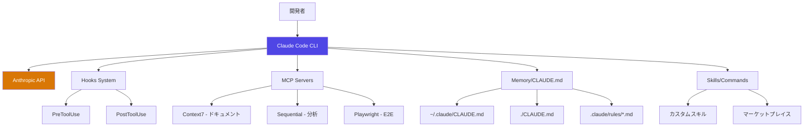
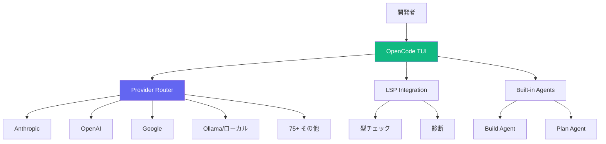
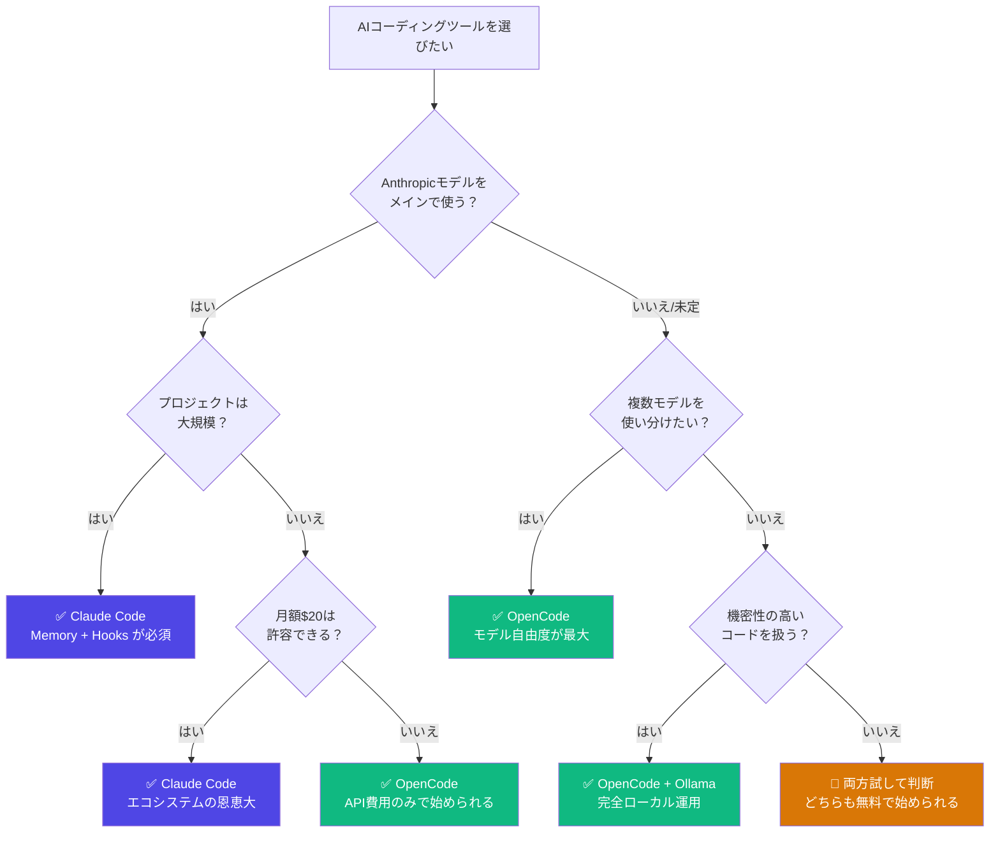

## 🎯 TL;DR — 結論を先に

**Claude Code** と **OpenCode** は、スペックシートだけ見ると似ている。どちらもターミナルベースのAIコーディングツールで、LLMと対話しながらコードを書く。

しかし、**毎日8時間以上、119体のAIエージェントを運用している立場**から言うと、この2つは根本的に違うものだ。

| 観点 | Claude Code | OpenCode |
|------|------------|----------|
| 設計思想 | 統合プラットフォーム | 汎用クライアント |
| エコシステム | hooks/MCP/memory/skills | LSP + 75+ プロバイダー |
| ロックイン | Anthropicに依存 | モデル非依存 |
| 実務の強さ | 大規模プロジェクト運用 | マルチモデル実験 |
| コスト | 月$20〜$200 | API費用のみ（ツール無料） |

**結論**: 1つのモデルで深く使い込むなら Claude Code。複数モデルを横断して使いたいなら OpenCode。ただし、**プロダクション運用で差がつくのはエコシステム**であり、現時点では Claude Code が圧倒的に成熟している。


## 🏗️ 前提：筆者の使用環境

この記事は「ちょっと触ってみた」レベルの比較ではない。

僕は **AEGIS** という、119体のAIエージェントで構成されたマルチ組織システムを1人で運営している。14の部門（プロダクト、セキュリティ、クリエイティブ、デザインなど）に分かれ、コード生成からコンテンツ制作、セキュリティ監査まで自律的に動く。

日常的な使い方：

- **Claude Code**: メイン開発環境。98K LOCのエンジン層を含む大規模コードベースで毎日稼働
- **OpenCode**: マルチモデル比較と、Claude以外のLLMを使いたい場面で使用
- **ローカルLLM**: Ollama経由でqwen2.5:14bを運用タスクに使用

この環境で半年以上両方を使ってきた実感を書く。


## 🔧 アーキテクチャ比較

まず、両者の設計思想の違いを可視化する。

### Claude Code のアーキテクチャ



**特徴**: Claude Code は Anthropic のモデルと深く統合されている。Hooks、MCP、Memory、Skills の4層のエコシステムが、単なるLLMクライアントを超えた「開発プラットフォーム」にしている。

### OpenCode のアーキテクチャ



**特徴**: OpenCode は Go (Bubble Tea) で書かれた高速なTUIクライアント。75以上のLLMプロバイダーに対応し、モデル非依存。LSP統合でエディタレベルのコード理解を持つ。

### 根本的な違い

Claude Code は **「Anthropicのモデルを最大限に活かすためのプラットフォーム」** だ。一方、OpenCode は **「どんなLLMでも使える汎用クライアント」** だ。

これは iPhone と Android の関係に似ている。垂直統合 vs オープンエコシステム。どちらが優れているかではなく、何を重視するかの問題だ。


## 💻 日常ワークフローでの違い

スペックの比較は誰でもできる。ここからは、毎日使っている人間だけが知っている違いを書く。

### Claude Code の日常

```bash
# プロジェクトに入った瞬間、CLAUDE.md を読んで文脈を理解
cd ~/Workspace/aegis
claude

# 119エージェントの組織ルール、デザイン原則、セキュリティポリシー
# — すべて CLAUDE.md と .claude/rules/ から自動ロード

# Hooksが勝手にセキュリティチェック
# → detect-secrets scan が PreToolUse で走る
# → サプライチェーン検証が自動実行

# /spawn で並列タスク実行
/spawn "フロントエンドの修正" "APIのテスト追加" "ドキュメント更新"
# → 3つのサブエージェントが同時に動く
```

**Claude Code の強み: コンテキストの永続性。** プロジェクトのルール、過去の判断、アーキテクチャの制約 — これらが Memory として蓄積される。セッションを跨いでも、前回の文脈を覚えている。

AEGISでは `.claude/rules/` に開発ルール、デザイン原則、運用手順を格納している。Claude Code はこれを毎回自動で読み込む。「このプロジェクトでは Protocol + Composition パターンを使って」と毎回説明する必要がない。

### OpenCode の日常

```bash
# 起動
opencode

# モデルを選択（セッション中に切り替え可能）
# Claude 4 Opus → コスト高いが正確
# GPT-4o → バランス型
# Gemini 2.5 Pro → 長いコンテキスト
# DeepSeek V3 → コスト最小

# LSPが型情報とエラーを自動提供
# → AIがコンパイルエラーを見ながら修正してくれる

# Build/Plan エージェントで段階的に実装
/plan "新しいAPIエンドポイントを設計して"
/build "設計に基づいて実装して"
```

**OpenCode の強み: モデルの自由度。** タスクの性質に応じてモデルを使い分けられる。コスト最適化のために安いモデルで初期実装し、重要な部分だけ高価なモデルで仕上げる — そういう戦略が取れる。

### 実務でぶつかる壁

| シナリオ | Claude Code | OpenCode |
|---------|------------|----------|
| 大規模リファクタリング | ✅ Memory + Hooksで安全に進行 | ⚠️ 文脈管理は自分で |
| マルチモデル比較 | ❌ Anthropic固定 | ✅ 即座にモデル切替 |
| セキュリティ監査 | ✅ Hooks + detect-secrets自動化 | ⚠️ 手動でツール連携 |
| コスト最適化 | ⚠️ Anthropicの料金体系に依存 | ✅ 安いモデルを自由に選択 |
| チーム共有 | ✅ CLAUDE.md + Skills を git管理 | ⚠️ 設定のポータビリティは限定的 |
| オフライン開発 | ❌ クラウド必須 | ✅ Ollama等でローカル動作 |


## 🧩 エコシステムの成熟度

ここが最大の差だ。ツールとしての完成度ではなく、**周辺エコシステムの厚み**。

### Hooks（自動化パイプライン）

Claude Code の Hooks は、AIの行動にプログラマブルなガードレールを張れる。

```json
// .claude/settings.json
{
  "hooks": {
    "PreToolUse": [
      {
        "command": "bash .claude/hooks/verify-supply-chain.sh",
        "description": "サプライチェーン検証"
      }
    ],
    "PostToolUse": [
      {
        "command": "bash .claude/hooks/track-skill-usage.sh",
        "description": "スキル使用追跡"
      }
    ]
  }
}
```

AEGISでは、コード変更のたびに自動でセキュリティスキャンが走る。環境変数の流出を検出するフック、依存パッケージの安全性を検証するフック — **人間が忘れても、システムが守る**。

OpenCode にはこのレベルの自動化レイヤーが存在しない。LSP統合は優秀だが、「AIの行動を制御する」仕組みではなく「AIにコード情報を提供する」仕組みだ。方向が逆。

### MCP（外部ツール統合）

```bash
# Claude Code + MCP の例
# Context7でライブラリのドキュメントを取得
# → Sequential で設計分析
# → Playwright でE2Eテスト
# これが1つのセッション内でシームレスに動く
```

MCPはAnthropicが策定したオープンプロトコルで、OpenCode側も対応し始めている。しかし、Claude Code は MCPのファーストパーティ実装であり、統合の深さが違う。

### Memory / CLAUDE.md

Claude Code の Memory システムは3層構造：

```
~/.claude/CLAUDE.md          # グローバルルール（全プロジェクト共通）
./CLAUDE.md                   # プロジェクトルール
.claude/rules/*.md            # 詳細ルール（自動ロード）
.claude/memory/MEMORY.md      # 自動記憶（セッション跨ぎ）
```

AEGISでは、このMemoryに過去の意思決定、アーキテクチャ判断、障害対応の記録が蓄積されている。新しいセッションを開始しても、「前回のボードルーム会議で承認されたレスポンシブデザイン方針」を覚えている。

OpenCode には同等の永続的コンテキスト管理は存在しない。セッション内の文脈保持は優秀だが、セッション間の知識の引き継ぎは開発者が手動で管理する必要がある。

### Skills / Commands

```markdown
<!-- .claude/skills/security-hacker のようなカスタムスキル -->
# Security Hacker Skill
PTES methodology, OWASP Top 10, AI-specific attacks...
```

Claude Code の Skills は、繰り返し使う複雑な指示をパッケージ化できる。マーケットプレイスからインストールも可能。AEGISでは80以上のスキルを運用している。

OpenCode の Build/Plan エージェントは組み込みで便利だが、カスタムエージェントの定義やマーケットプレイスの仕組みはまだ発展途上だ。

### エコシステム成熟度スコア

| 機能 | Claude Code | OpenCode |
|------|:-----------:|:--------:|
| 自動化 (Hooks) | ★★★★★ | ★★☆☆☆ |
| 外部統合 (MCP) | ★★★★★ | ★★★☆☆ |
| 文脈永続化 (Memory) | ★★★★★ | ★★☆☆☆ |
| カスタム拡張 (Skills) | ★★★★☆ | ★★★☆☆ |
| マルチモデル | ★★☆☆☆ | ★★★★★ |
| LSP統合 | ★★★☆☆ | ★★★★★ |
| デスクトップUI | ★★☆☆☆ | ★★★★☆ |


## 🔀 マルチモデル戦略

ここは OpenCode の独壇場だ。

AEGISでは、タスクの複雑さに応じてモデルを使い分けている：

| タスクレベル | モデル | 用途 |
|------------|--------|------|
| OPERATIONAL | qwen2.5:14b (ローカル) | ステータス確認、ログ分析 |
| TACTICAL | Sonnet 4.6 | 実装、リファクタリング |
| STRATEGIC | Opus 4.6 | アーキテクチャ設計、セキュリティ監査 |

Claude Code では、この切り替えは `/model` コマンドで手動で行う。Anthropic のモデルファミリー内での切り替えは簡単だが、GPT-4oやGeminiに切り替えることはできない。

OpenCode では、設定ファイルで複数プロバイダーを定義して、セッション中に自由に切り替えられる：

```toml
# opencode.toml
[providers.anthropic]
api_key_env = "ANTHROPIC_API_KEY"

[providers.openai]
api_key_env = "OPENAI_API_KEY"

[providers.ollama]
base_url = "http://localhost:11434"
```

**2026年1月の事件** にも触れておく。Anthropic が OpenCode の Claude OAuth トークン利用をブロックした。これにより、OpenCode から Claude を使うには自前のAPIキーが必要になった。ベンダーロックインのリスクを示す出来事だ。

### 歴史的経緯も重要

OpenCode の歴史は少し複雑だ。オリジナルの `opencode-ai/opencode` リポジトリは2025年9月にアーカイブされ、Charm チームが **Crush** として継続開発している。現在の opencode.ai は月間500万人の開発者を持つ別プロジェクトで、120K以上のGitHub starを獲得している。名前の混同に注意が必要だ。


## 🔒 プライバシーとセキュリティ

### Claude Code

- コードは Anthropic のAPIに送信される
- Anthropic の利用規約に基づくデータ取り扱い
- Claude Pro ($20/月) の場合、トレーニングに使用されない
- API直接利用の場合も、30日間のログ保持（Anthropic ポリシー）

### OpenCode

- **プライバシーファースト設計**: コードをサーバーに保存しない
- ローカルのみで動作し、選択したLLMプロバイダーにのみデータ送信
- Ollamaと組み合わせれば、完全にオフラインで動作可能
- MIT ライセンス — ソースコードを完全に監査可能

**実務での判断**: 機密性の高いプロジェクト（NDA案件、金融系、医療系）では、OpenCode + ローカルLLMの組み合わせが安全だ。一方、一般的な開発では Claude Code の利便性がセキュリティ上の懸念を上回る。

AEGISでは、セキュリティ org が全コードのレビューを担当し、Hooks でシークレットの流出を自動検出している。ツールに頼るだけでなく、プロセスでカバーする設計が重要だ。


## 💰 コストシミュレーション

実際にいくらかかるのか。月間利用量別で比較する。

### Claude Code のコスト

| プラン | 月額 | 含まれるもの |
|--------|------|------------|
| Claude Pro | $20 | Claude Sonnet + Code 基本利用 |
| Claude Pro + 従量課金 | $20 + API費用 | Opus利用、大量リクエスト |
| Max (5x) | $100 | Opus含む大容量 |
| Max (20x) | $200 | ヘビーユーザー向け |

### OpenCode のコスト

| 構成 | 月額 | 内訳 |
|------|------|------|
| ツール本体 | $0 | MIT ライセンス、無料 |
| Ollama のみ | $0 | 電気代のみ |
| Claude API 経由 | 〜$30-80 | 利用量次第 |
| GPT-4o API 経由 | 〜$20-60 | 利用量次第 |
| DeepSeek V3 | 〜$5-15 | 格安 |

### 月間利用量別の現実的なコスト

| 利用パターン | Claude Code | OpenCode (最安構成) | OpenCode (高品質構成) |
|-------------|:-----------:|:------------------:|:-------------------:|
| ライト（週10時間） | $20 | $0-5 | $20-30 |
| ミドル（週20時間） | $100 | $5-15 | $40-60 |
| ヘビー（週40時間+） | $200 | $15-30 | $80-120 |

**注意**: Claude Code の Max プランは定額でレート制限内なら使い放題。API従量課金は使い方次第で跳ねる。OpenCode は「安いモデルで下書き → 高いモデルで仕上げ」戦略でコスト最適化できる。

僕の場合、Claude Code Max ($200) + Ollama (ローカル、$0) の組み合わせで運用している。月$200は高く感じるかもしれないが、119エージェントの運用で得られる生産性を考えると、十分に元が取れている。


## 🗺️ 選び方フローチャート




## 📊 ベンチマークと市場ポジション

数字で語れる部分も整理しておく。

| 指標 | Claude Code | OpenCode |
|------|------------|----------|
| SWE-bench Pro | **57.5%** (業界最高水準) | モデル依存 |
| GitHub コミット比率 | **全体の4%** | 非公開 |
| GitHub Stars | 非公開（CLIツール） | **120K+** |
| 月間ユーザー | 非公開 | **500万+** |
| 対応LLMプロバイダー | 1（Anthropic） | **75+** |
| ライセンス | プロプライエタリ | **MIT** |

SWE-bench Pro 57.5% は「実際のソフトウェアエンジニアリングタスクをどれだけ解けるか」の指標だ。Claude Code がClaude モデルの能力を最大限引き出せている証拠と言える。

一方、OpenCode の 120K stars と 500万ユーザーは、オープンソースコミュニティの支持の大きさを示している。


## 🏁 まとめ — 実務者としての本音

半年間、両方を実戦投入して分かったこと。

**Claude Code を選ぶべき人:**
- 1つのプロジェクトを長期的に深く開発する人
- Memory / Hooks / MCP のエコシステムに価値を感じる人
- Anthropicモデルの品質に満足している人
- チームでルール（CLAUDE.md）を共有したい人

**OpenCode を選ぶべき人:**
- 複数のLLMを使い分けたい人
- コストを最小化したい人
- プライバシーを重視する人（ローカルLLM運用）
- オープンソースを好む人

**僕の選択:** 両方使っている。メインは Claude Code、サブで OpenCode + Ollama。

理由は単純で、**エコシステムの成熟度が生産性に直結する**からだ。119エージェントを運用するシステムで、Memory が過去の判断を覚えていること、Hooks がセキュリティを自動で守ること、MCP が外部ツールとシームレスに連携すること — これらは「あったら便利」ではなく「ないと運用できない」レベルだ。

しかし、モデルの選択肢が1社に限定されるリスクは無視できない。2026年1月のOAuthブロック事件が示すように、プラットフォームの方針変更に振り回される可能性は常にある。だから、OpenCode + ローカルLLMという逃げ道は確保しておく。

最終的な判断基準は1つ。

**「あなたのワークフローで、モデルの多様性と、エコシステムの深さ、どちらがボトルネックか？」**

この問いに答えれば、選択は自ずと決まる。

---

📝 質問や議論はコメント欄で。実際に使っている方の体験談も聞きたいです。

🔗 関連記事:
- [Claude Code の知られざる機能10選](https://zenn.dev/th19930828/articles/09-claude-code-hidden-features)
- [AIエージェント116体で会社を動かしている話](https://zenn.dev/th19930828/articles/05-solopreneur-ai-agents)
